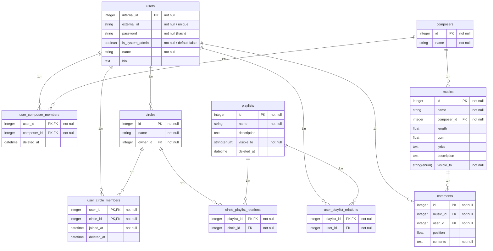

# OtoCircle

## OtoCircle の概要

音楽クリエイターと作曲系サークルのための楽曲管理・配信サービスです。

従来の音楽配信サービスが持つ、音楽の再生・レコメンド・プレイリスト作成などリスナーサイドの機能に加えて、音楽クリエイターが自分で音楽を投稿でき、サークル内あるいはグローバルに公開できるクリエイターサイドの機能も備えます。

さらに、リスナーとクリエイターのインタラクションを促進するためのコメント機能、フォロー機能を持ち、定期的なサービス内イベントの開催などを行える基盤としての役割も果たします。

## OtoCircle の機能

OtoCircle は、以下の機能を持つアプリケーションとなる予定です。

- ユーザー機能とサークル機能
    - ユーザーの作成・検索・削除、プロフィールの閲覧・編集
    - サークルの作成・検索・削除、プロフィールの閲覧・編集
    - ユーザーのサークルへの所属関係の設定・解除
- 音楽ストリーミングアプリとしての機能
    - 音楽の検索
    - おすすめや新作のレコメンド
    - 音楽のストリーミング再生
    - 音楽の情報の閲覧
    - (発展) 外部 API を利用して大手ストリーミングサービスの音楽を取得
- 音楽投稿サイト、楽曲データベースとしての機能
    - 音楽の投稿・削除、情報の編集  <!-- 普通のインデクス情報に加えて BPM とかも -->
    - プレイリストへの追加・閲覧・編集・削除
    - 音楽・プレイリストの公開範囲 (自分だけ／サークル／グローバル) 設定
- 音楽を介したユーザー同士のインタラクション機能
    - (発展) お気に入りへの追加・閲覧・編集・削除
    - コメントの追加・閲覧・編集・削除
    - (発展) ユーザー間のフォロー・フォロワー関係
    - (発展) 投票やクイズなど定期的なイベントの開催
- (発展) 通知機能
    - (発展) フォローしたユーザーの更新通知
    - (発展) サークル内ユーザーの更新通知  <!-- Misskey の LTL, GTL 機能 -->
    - (発展) システム通知

## ユーザーのロールについて

OtoCircle は、音楽のクリエイターとリスナーという非対称な関係をフラットにして、新しいインタラクションを促進するという観点から、ユーザーをクリエイター・リスナーというロールに分けておりません。

ユーザーのロールは、サークルやサービス全体の権限管理のために以下の通り用意します。

### システム管理者 (System Administrator)

システム全体に対し制御権限を持ちます。

管理画面を用意し、ユーザーの作成・閲覧・更新・削除 (CRUD)、ロールの設定などの一括管理や、その他諸エンティティの CRUD を一元的に行えます。

(発展) システム通知を発行する権限も持ちます。

### サークル管理者 (Circle Administrator)

自サークルに対する CRUD を制御する権限を持ちます。

他ユーザーをサークルに追加・解除することができます。

サークル公式としてのプレイリストの CRUD を行うこともできます。

### ユーザー (User)

以上の権限を持ちませんが、その他のユーザー機能・ストリーミング機能・投稿機能・インタラクション機能を持ちます。

### ロールごとの機能比較

各ロールは、下表の通り権限が異なります。

| |SAdmin|CAdmin|User|
|:-|:-:|:-:|:-:|
|ユーザーの作成・検索・閲覧|○|○|○|
|ユーザーの削除・編集|○|自分のみ|自分のみ|
|サークルの作成・検索・閲覧|○|○|○|
|サークルの削除・編集|○|自サークルのみ| |
|任意ユーザー・サークルの所属関係の設定・解除|○| | |
|任意ユーザーの自サークルへの招待・キック|○|○| |
|自分の任意サークルへの応募・脱退|○|○|○|
|大手ストリーミングサービスの音楽を登録|○|○|○|
|音楽の投稿|○|○|○|
|音楽の検索・レコメンド・閲覧・再生|○|○|○|
|音楽の削除・編集|○|自分ののみ|自分ののみ|
|個人プレイリストの作成|○|○|○|
|サークルプレイリストの作成|○|○| |
|プレイリストの検索・閲覧|○|公開のみ|公開のみ|
|プレイリストの削除・編集|○|自サークルのみ|自分ののみ|
|コメントの追加・検索・閲覧|○|○|○|
|コメントの削除|○|自分ののみ|自分ののみ|
|お気に入りへの追加・閲覧・削除|○|自分ののみ|自分ののみ|
|ユーザー間のフォロー・フォロワー解除|○|自分ののみ|自分ののみ|
|投票やクイズなど定期的なイベントの開催|○| | |
|システム通知の発行|○| | |
|ユーザーの更新通知、システム通知を受け取る|○|○|○|

## OtoCircle の技術

### 利用技術

WIP

### ER 図

#### 概念モデル

##### ユーザー (users)

- `internal_id` PK: ユーザーの識別 ID。一意的に与えられて変更できない。
- `external_id`: ログイン用の ID。ユーザーが変更できる。
- `password`: ログインパスワード。ハッシュ化されるはず
- `is_system_admin`: システム管理者か否か
- `name`: ニックネーム
- `bio`: 自己紹介

##### 作曲者名義 (composers)

ユーザーとは many-to-many 関係です。
一人のユーザーが複数の名義で曲を投稿し、一つの合作名義が複数のユーザーを持ちえます。

- `id` PK: 作曲者名義の識別 ID
- `name`: 作曲者名義

##### サークル (circles)

ユーザーの集まりであり、音楽の公開範囲の一つの尺度となっています。

ユーザーとは many-to-many 関係です。
一人のユーザーは複数のサークルに所属し、一つのサークルは複数のユーザーを持ちえます。

また、サークルの代表 (owner) に関してユーザーとは one-to-many 関係です。
サークルは必ず 1 人だけ代表者を持ちます。代表者は必ずサークル管理者です。

- `id` PK: サークルの識別 ID
- `name`: サークル名
- `owner_id`: サークル代表のユーザー ID

##### 音楽 (musics)

作曲者名義とは one-to-many 関係です。
音楽は必ず 1 つだけ作曲者名義を持ちます。

- `id`: 音楽の識別 ID
- `name`: 曲名
- `composer_id`: 作曲者の作曲者名義 ID
- `length`: 曲の長さ (後述するコメントの位置に利用)
- `bpm`: 曲の BPM (DJ などのユースケースに便利)
- `lyrics`: 曲の歌詞
- `description`: 曲の概要
- `visible_to`: 公開範囲 (自分のみ / サークル / グローバル)

##### プレイリスト (playlists)

音楽をリストで集めたもの。サークルのアルバムとしての扱いや、各個人の愛聴盤をまとめたり、作曲の際のリファレンスをまとめたり、DJ のセットリストとして使えます。

サークルのプレイリストの場合、サークルと one-to-many 関係です。
個人のプレイリストの場合、ユーザーと one-to-many 関係です。
プレイリストは、必ず 1 つのサークルか 1 人の個人に紐づきます。

- `id`: プレイリストの識別 ID
- `name`: プレイリスト名
- `is_circle`: `true` ならサークルプレイリスト、`false` なら個人プレイリスト
- `creator_id`: polymorphic な値。`is_circle == true` ならサークル ID、`is_circle == false` ならユーザー ID
- `description`: プレイリストの説明
- `visible_to`: 公開範囲 (自分のみ / サークル / グローバル)

##### コメント (comments)

音楽の特定の位置にコメントをすることができる。ニコニコ動画のコメントのようにリアルタイムで表示できることを目指す。

音楽とユーザーとは、それぞれ one-to-many 関係にあります。
コメントは必ず 1 つの音楽と 1 人のユーザーに紐づきます。

- `id`: コメントの識別 ID
- `music_id`: コメントの付いている音楽の ID
- `user_id`: コメントをしたユーザーの ID
- `position`: コメントの曲での位置。音楽の `length` より短い
- `contents`: コメントの内容

#### 論理モデル

概念モデルから適切に中間テーブルを増やし、一貫性制約を追加することで、完成した関係スキーマは下図の通りです。

概念モデルから新たに追加されたテーブルについて説明します。

##### ユーザー・作曲者名義中間テーブル (users_composer_members)

ユーザーと作曲者名義の間にあった many-to-many 関係を解消して、外部キー制約を記述するためのテーブルです。

- `user_id` PK: ユーザーの識別 ID
- `composer_id` PK: 作曲者名義の識別 ID
- `deleted_at`: 論理削除のための属性。削除された場合にレコードごと削除するのではなく、ここに削除時刻を格納する。

##### ユーザー・サークル中間テーブル (users_circle_members)

ユーザーとサークルの間にあった many-to-many 関係を解消して、外部キー制約を記述するためのテーブルです。

- `user_id` PK: ユーザーの識別 ID
- `circle_id` PK: サークルの識別 ID
- `joined_at`: サークルに追加された時刻
- `deleted_at`: 論理削除のための属性。削除された場合にレコードごと削除するのではなく、ここに削除時刻を格納する。

##### 個人プレイリスト中間テーブル (user_playlist_relations)

プレイリストが持っていた個人・サークルという多相性を解消して、外部キー制約を記述するためのテーブルです。

- `user_id` PK: ユーザーの識別 ID
- `playlist_id`: プレイリストの識別 ID

##### サークルプレイリスト中間テーブル (circle_playlist_relations)

プレイリストが持っていた個人・サークルという多相性を解消して、外部キー制約を記述するためのテーブルです。

- `circle_id` PK: サークルの識別 ID
- `playlist_id`: プレイリストの識別 ID

### REST API docs

## OtoCircle の野望

### 音楽配信サービスの現状

音楽ストリーミング配信サービスは、近年人気のあるオンラインサービスです。大手の楽曲配信サービスの例として、Spotify や SoundCloud などが挙げられます。それらの楽曲配信サービスは、以下のような基本的な機能を共通して持っています。

- リスナーサイドの機能 (音楽の検索、レコメンド、再生、プレイリスト作成など)
- クリエイターサイドの機能 (音楽の登録、ストリーミングによる収益還元など)

ただし、クリエイターサイドの機能は、著作権管理事業者を通じて間接的に行われていることが多く、クリエイターとリスナーがフラットな関係で活発にインタラクションを持てているとは言い難いです。

なお、クリエイターとリスナーのインタラクションは、Twitter (現 X) や YouTube のコメント欄など、音楽配信サービスとは別の SNS で行われることが多いです。

### ネットインディーズ音楽と作曲系サークルの台頭

デジタル技術の発展に伴い、コンピュータで誰でも音楽を制作し、インターネットで配信できる時代がやってきました。インターネットでは、数多くのインディーズ音楽 (同人音楽) が発掘されるのを待っています。M3 などの同人音楽即売会やクラブイベントなどを通じてリスナーに名が知られた同人音楽もありますが、数多くのネットインディーズ音楽はその実力に反して注目を浴びていません。

また、そのようなインディーズ音楽の重要な発信源として、作曲系サークルやユニットが存在します。そのようなサークルでは、メンバーが制作した未リリースの音楽を聴き合って、感性や技術を磨いていきます。作曲系サークルのメンバーは、同時にクリエイターでもありリスナーでもあるのです。

ネットインディーズ音楽と作曲系サークルの台頭に合わせて、既存の音楽配信サービスに加えてクリエイターサイドの機能を充実させ、さらにクリエイター・リスナーのフラットなインタラクションを促進し、両者を繋げるサービスが重要となります。

### OtoCircle の 3 つのフェーズ

サービスとしての成長を期待して、OtoCircle は音楽配信サービスとして以下の 3 つのフェーズを経て成長することを目標とします。

- 音楽クリエイターと作曲系サークルのための楽曲管理・配信サービス
- インターネットインディーズ音楽の分散型データベース・配信サービス
- すべてのクリエイターとリスナーを繋げる、分散型音楽ストリーミングサービス

### OtoCircle のビジョン: 生活に溶け込む、クリエイティビティ

#### クリエイターの地位向上

- どんなクリエイターでも、曲が誰かに聴かれる、発掘される、愛されるセカイ
- 初心者が様々な音楽をインプットして、成長しやすいセカイ
- 最終的には、自分の音楽で人と人が、人と自分が繋がっていることを実感できるミライ
<!-- Kiite で忌避された自薦が、ここでは推奨されたい -->

#### クリエイターとリスナーの壁を壊す

<!-- - 就活で使える
    - そこそこ高難易度な DB 設計
    - Rails, React (Go, Vue.js?) -->

- 様々なユーザーがフラットな関係でインタラクションを行う
    - アマチュア DTMer
    - 大学生作曲サークル
    - 曲 digger、ボカロリスナー
    - DJ やりたい人
    - その他、曲を分析して色々やりたい人
